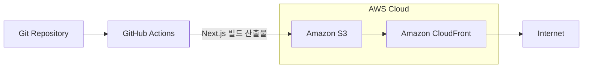

# Links
- [S3 bucket website](http://hanghae-plus-front-2nd-bucket.s3-website-us-east-1.amazonaws.com)
- [CloudFront deployment domain](https://d2v41ic8c60t22.cloudfront.net)

<br />

# Diagram




<br />

# CI/CD pipeline
1. ```main``` 브랜치에 ```push``` 이벤트가 있을 때 워크플로우가 트리거됩니다.
2.  ```actions/checkout@v4.1.7```을 사용하여 리포지토리 코드를 체크아웃합니다.
3.  ```npm ci```를 사용하여 프로젝트의 의존성을 설치합니다.
4.  ```npm run build```를 사용하여 프로젝트를 빌드합니다.
5.  ```aws-actions/configure-aws-credentials@v4.0.2```을 사용하여 AWS 자격 증명을 설정합니다.
6. 액션의 입력 파라미터를 지정합니다.
  - ```aws-access-key-id```: GitHub Secrets에서 가져온 AWS 액세스 키 ID입니다.
  - ```aws-secret-access-key```: GitHub Secrets에서 가져온 AWS 비밀 액세스 키입니다.
  - ```aws-region```: GitHub Secrets에서 가져온 AWS 리전입니다.
7. ```aws s3 sync out/ s3://${{ secrets.S3_BUCKET_NAME }} --delete```: 로컬 out/ 디렉토리를 지정된 S3 버킷과 동기화하고, ```out/``` 디렉토리에 없는 파일은 S3 버킷에서 삭제합니다. S3 버킷 이름은 ```GitHub Secrets```에서 가져옵니다.
8. ```aws cloudfront create-invalidation --distribution-id ${{ secrets.CLOUDFRONT_DISTRIBUTION_ID }} --paths "/*"```: CloudFront에서 모든 파일(```/*```)에 대해 캐시 무효화를 생성합니다. CloudFront 배포 ID는 GitHub Secrets에서 가져옵니다.

<br />

# 주요 개념


## GitHub Actions과 CI/CD 도구

**GitHub Actions**는 GitHub에서 제공하는 강력한 CI/CD(Continuous Integration/Continuous Deployment) 플랫폼입니다. 이를 통해 코드가 변경될 때마다 자동으로 테스트, 빌드, 배포 작업을 실행할 수 있습니다. GitHub Actions는 다음과 같은 기능을 제공합니다:

- **워크플로우**: YAML 파일로 정의된 자동화 프로세스. 특정 이벤트(예: 코드 푸시, 풀 리퀘스트 등)가 발생할 때 실행됩니다.
- **액션**: 워크플로우 내에서 수행되는 개별 작업. GitHub Marketplace에서 다양한 액션을 사용할 수 있으며, 커스텀 액션을 작성할 수도 있습니다.
- **러너**: 워크플로우를 실행하는 환경. GitHub에서 제공하는 호스팅 러너(예: Ubuntu, Windows, macOS) 또는 셀프 호스팅 러너를 사용할 수 있습니다.

GitHub Actions를 사용하면 코드 변경 사항을 자동으로 테스트하고, 빌드하고, 배포할 수 있어 개발 주기를 단축하고 품질을 높일 수 있습니다.

## S3와 스토리지

**AWS S3**는 AWS에서 제공하는 확장 가능하고 안전한 객체 스토리지 서비스입니다. S3를 사용하면 대용량 데이터를 손쉽게 저장하고 검색할 수 있습니다. 주요 특징은 다음과 같습니다:

- **확장성**: S3는 자동으로 확장되어 대량의 데이터를 저장할 수 있습니다.
- **내구성**: S3는 데이터의 내구성을 보장하기 위해 여러 가용 영역에 데이터를 복제합니다.
- **보안**: S3는 데이터 암호화와 다양한 액세스 제어 메커니즘을 제공합니다.
- **비용 효율성**: 사용한 만큼만 비용을 지불하는 모델로 운영됩니다.

S3는 웹 애플리케이션의 정적 콘텐츠(예: HTML, CSS, JavaScript 파일) 저장 및 제공에 적합하며, 백업 및 복원, 빅데이터 분석 등 다양한 용도로 사용됩니다.

## CloudFront와 CDN

**AWS CloudFront**는 AWS에서 제공하는 글로벌 콘텐츠 전송 네트워크(CDN) 서비스입니다. CloudFront는 전 세계의 엣지 로케이션을 통해 사용자에게 콘텐츠를 빠르게 전달합니다. 주요 특징은 다음과 같습니다:

- **저지연**: 사용자에게 가장 가까운 엣지 로케이션에서 콘텐츠를 제공하여 지연 시간을 최소화합니다.
- **보안**: CloudFront는 DDoS 방어, SSL/TLS 암호화, AWS WAF(Web Application Firewall) 통합 등 다양한 보안 기능을 제공합니다.
- **유연성**: 정적 및 동적 콘텐츠 모두를 캐싱하고 제공할 수 있습니다.
- **통합**: S3, EC2, Lambda@Edge 등 다른 AWS 서비스와 원활하게 통합됩니다.

CloudFront는 웹 애플리케이션의 성능을 향상시키고, 전 세계 사용자에게 일관된 경험을 제공합니다.

## 캐시 무효화(Cache Invalidation)

**캐시 무효화**는 CloudFront와 같은 CDN에서 캐시된 콘텐츠를 새로 고침하는 과정입니다. 이는 콘텐츠가 업데이트되었을 때 사용자가 최신 버전을 볼 수 있도록 보장합니다. 캐시 무효화는 다음과 같은 방식으로 수행됩니다:

- **지정된 경로 무효화**: 특정 파일 또는 경로의 캐시를 무효화합니다. 예를 들어, `/index.html` 파일을 무효화하면 해당 파일이 업데이트된 경우 새 버전이 제공됩니다.
- **와일드카드 무효화**: 와일드카드를 사용하여 여러 파일을 한 번에 무효화할 수 있습니다. 예를 들어, `/*`는 모든 파일을 무효화합니다.

AWS CLI를 사용하여 CloudFront 캐시 무효화를 실행할 수 있습니다:
```sh
aws cloudfront create-invalidation --distribution-id <DISTRIBUTION_ID> --paths "/*"
